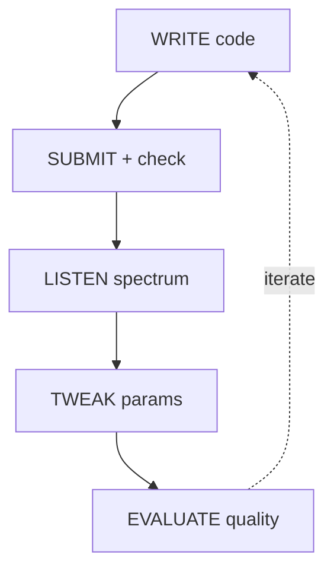

# Alignement des spécifications avec AI-AUTHORING.md

Rapport produit le 2026-05-27 sur la branche `doc-alignment`.

Référence d'écriture : [AI-AUTHORING.md](AI-AUTHORING.md) (convention markpage).

Périmètre audité : les 11 fichiers `SPECIFICATION*.md` (~3055 lignes).
Hors périmètre de cet audit : `README.md`, `ARCHITECTURE.md`, `FORMAL_METHOD.md`,
`DOCKERWEBTOOL.md`, `ANNONCE.md`, `FULLSPEC.md`.

---

## 1. Préambule : markpage n'est pas une cible de build de ce repo

`markpage` n'est référencé ni dans `package.json` ni dans aucun script. Les
spécifications sont donc actuellement rendues uniquement par GitHub (CommonMark
+ GFM) et par l'IDE.

Conséquence directe pour ce rapport :

- Les corrections **Pass 1** (Unicode, lang hint, hiérarchie, échappements
  parasites) restent bénéfiques quel que soit le moteur de rendu — elles ont
  été appliquées sans condition.
- Les recommandations **Pass 2** (`adt`, `inference`, `category`, `bda`,
  `algorithm`, `ebnf`, `demo`) ne produisent un rendu enrichi que si la doc
  passe un jour par markpage. Sur GitHub, ces fences custom s'affichent comme
  des blocs `<pre>` non colorés, sans dégrader la lisibilité.

Décision attendue de l'auteur :

1. **Markpage est une cible probable** ⇒ appliquer Pass 2 par lots prioritaires
   (voir §4).
2. **Markpage reste une référence stylistique** ⇒ ne pas refondre, garder Pass
   1 et laisser ce rapport comme mémo pour plus tard.

---

## 2. Pass 1 — Conformité (déjà appliquée sur cette branche)

| Commit | Fichier | Nature de la correction |
|---|---|---|
| `530a44c` | AI-AUTHORING.md | Ajout du fichier de référence |
| `c69c9a3` | SPECIFICATION.md | 19× suppression de `\"...\"` parasites dans les blocs fenced (artefacts de copier-coller JS/TS) |
| `09e3ecb` | SPECIFICATION-MCP-INTERACTIONS.md | 2× ajout du lang hint `text` sur les blocs fenced anonymes (pseudocode + ASCII art) |

Les huit autres fichiers étaient déjà conformes au scan automatique et à la
relecture (pas de LaTeX gratuit, pas de Mermaid avec flèches Unicode, pas de
violation de hiérarchie, pas de mismatch table dense vs `csv`).

---

## 3. Pass 2 — Recommandations par fichier

Notation : 🔴 fort gain attendu · 🟡 gain modéré · 🟢 gain marginal.

### 3.1. SPECIFICATION.md

Le poids spécifique du document (934 lignes) et la densité de définitions
formelles en font le candidat principal pour markpage.

| § | Lignes | Bloc actuel | Bloc cible | Priorité |
|---|---|---|---|---|
| Modèle formel — Types | 199-220 | `text` | `adt` | 🔴 |
| Structure d'une session | 304-317 | `text` | `adt` | 🔴 |
| Métadonnées | 321-327 | `text` | `adt` | 🔴 |
| CppPreset | 449-455 | `text` | `adt` | 🔴 |
| Loop de synchro UI (U1-U4) | 242-257 | `text` | `algorithm` | 🟡 |
| Règles d'application DSP (D1-D4) | 264-276 | `text` | `algorithm` ou `inference` | 🟡 |
| Locks (L1-L2) | 281-287 | `text` | `inference` | 🟡 |
| Opérations O-1..O-9 (notation `S⟦submit⟧`) | 344-474 | `text` | `inference` (la notation `E⟦…⟧` est explicitement supportée par AI-AUTHORING §inference) | 🔴 |
| Invariants INV-* | 333-338, 294-300 | `text` | `::: definition [Invariants]` callout ou rester en `text` | 🟢 |

Esquisse — extrait du modèle de paramètre converti en `adt` :

````markdown
```adt
ParamCell ::= { v : Value, d : Timestamp, owner : UIId | ⊥ }
DSPState  ::= { params : Map<ParamId, ParamCell> }
UIState   ::= { id : UIId, params : Map<ParamId, ParamCell>, drag : Set<ParamId> }
View      ::= "dsp" | "svg" | "run" | "cpp" | "tasks" | "signals"
```
````

Esquisse — O-1 converti en `inference` :

````markdown
```inference (Submit-Fresh)
code ≠ "" ; filename ends with ".dsp" ; sha = sha1(code) ; sha ∉ Sessions
---
Sessions' = Sessions ∪ { createSession(sha, code, filename) }
```

```inference (Submit-Hit)
code ≠ "" ; sha = sha1(code) ; sha ∈ Sessions
---
touch(Sessions[sha])
```
````

### 3.2. SPECIFICATION-EDIT-MODE.md

| § | Lignes | Bloc actuel | Bloc cible | Priorité |
|---|---|---|---|---|
| Types `EditRequest` / `EditResponse` | 41-64 | `text` | `adt` | 🔴 |
| Variables d'environnement et règle `containerPath = …` | 68-83 | `text` | `algorithm` (la partie résolution `targetFilename`) | 🟡 |
| Invariants INV-EDIT-* | 87-93 | `text` | rester en `text` | 🟢 |
| Opération `E⟦edit⟧` | 99-116 | `text` | `inference` ou `algorithm` | 🟡 |

### 3.3. SPECIFICATION-FAUST-CORE-UI.md

Document court (68 lignes) déjà dominé par du TypeScript correctement tagué.
Aucun candidat fort.

| § | Lignes | Recommandation | Priorité |
|---|---|---|---|
| Sections 5) et 6) | 58-69 | Possible callout `::: definition [Atomic update semantics]` mais sur-marquage probable | 🟢 |

### 3.4. SPECIFICATION-FAUST-ORBIT-UI.md

Idem — types TS déjà bien rendus. Quelques candidats marginaux :

| § | Lignes | Recommandation | Priorité |
|---|---|---|---|
| Distance mapping (l 126-129) | inline | Le passage `d <= innerRadius → value = max` etc. est typique d'une définition par cas : candidat `algorithm` ou prose mathématique en `$ … $` | 🟢 |
| Section 7) State import rules | 137-141 | Liste à puces déjà lisible | 🟢 |

### 3.5. SPECIFICATION-LIBRARYDOC.md

Signatures d'outils MCP en `text` ; gain markpage faible.

| § | Lignes | Recommandation | Priorité |
|---|---|---|---|
| Signatures MCP `search_faust_lib(...)` etc. | 30-72 | Possible passage en un seul bloc `algorithm` par outil, mais perte de lisibilité plate du `text` actuel | 🟢 |
| Invariants INV-LIBDOC-* | 78-82 | rester en `text` | 🟢 |

### 3.6. SPECIFICATION-MCP-INTERACTIONS.md

| § | Lignes | Bloc actuel | Bloc cible | Priorité |
|---|---|---|---|---|
| Diagramme ASCII de la boucle WRITE/SUBMIT/LISTEN/TWEAK/EVALUATE | 149-173 | `text` (ASCII art) | `mermaid` flowchart | 🔴 |
| Cycle de submit (l 24-28) | 24-28 | `text` | rester en `text` (le pseudocode horizontal avec `↓ fail` est lisible) | 🟢 |
| Tables tools/actions | 96-102, 136-141 | pipe | rester en pipe (contiennent du code inline qui interdit `csv`) | ✅ |

Esquisse — diagramme converti en `mermaid` :

````markdown

````

### 3.7. SPECIFICATION-RUN-PARAM-SYNC.md

Fichier déjà bien aligné (2 blocs Mermaid présents). Reste :

| § | Lignes | Bloc actuel | Bloc cible | Priorité |
|---|---|---|---|---|
| Types `RunParamCell`, `RunParamMap`, `Version` | 31-42 | `text` | `adt` | 🔴 |
| Règle R-6 (réconciliation per-path avec `pour tout p`, `si … sinon …`) | 411-448 | `text` | `algorithm` | 🟡 |
| Modèle press/release | 467-489 | `text` | rester en `text` | 🟢 |
| Invariants INV-1..8, Risques RISK-1..5, Tests TEST-1..7 | 452-549 | `text` | rester en `text` | 🟢 |

### 3.8. SPECIFICATION-VSCODE-PLUGIN.md

| § | Lignes | Bloc actuel | Bloc cible | Priorité |
|---|---|---|---|---|
| Types `PluginConfig`, `ConnectionState` | 43-60 | `text` | `adt` | 🔴 |
| Opérations V-1..V-4 (`C⟦connect⟧`, `E⟦edit_static⟧`, …) | 75-116 | `text` | `inference` | 🟡 |
| Invariants INV-VSC-* | 64-69 | `text` | rester en `text` | 🟢 |

### 3.9. SPECIFICATION_SPECTRUM.md

Document dominé par du JSON (déjà tagué `json`). Peu d'opportunités markpage :

| § | Lignes | Recommandation | Priorité |
|---|---|---|---|
| Définitions des champs `peakDbFSQ`, `clipRatioQ`, … | 235-248 | Candidat Pandoc definition list (term + `:`) plutôt que liste à puces actuelle | 🟡 |
| Heuristique de click | 250-259 | Candidat `algorithm` | 🟢 |
| Politique d'émission (seuils) | 292-307 | Rester en prose + liste | 🟢 |

---

## 4. Lots prioritaires recommandés (si markpage devient cible)

Si l'option « adopter markpage » est retenue, voici l'ordre proposé pour
maximiser le retour sur effort :

1. **Lot ADT** — passer tous les `Foo ::= { … }` et `Foo = A | B | C` en blocs
   `adt`. Concerne SPECIFICATION.md, SPECIFICATION-EDIT-MODE.md,
   SPECIFICATION-RUN-PARAM-SYNC.md, SPECIFICATION-VSCODE-PLUGIN.md. Gain
   visuel élevé (typographie cohérente, coloration des constructeurs vs
   variables), risque faible.
2. **Lot inférence** — convertir les opérations notées `S⟦…⟧` en blocs
   `inference`. C'est le rendu pour lequel cette notation est explicitement
   conçue dans AI-AUTHORING. Concerne surtout SPECIFICATION.md (O-1..O-9) et
   SPECIFICATION-EDIT-MODE.md.
3. **Lot mermaid** — convertir le diagramme ASCII de
   SPECIFICATION-MCP-INTERACTIONS.md en `mermaid flowchart`. Petit, gain visuel
   net.
4. **Lot algorithm** — convertir les pseudocodes structurés (boucles U1-U4,
   règles D1-D4, R-6) en `algorithm`. Plus délicat car il faut choisir une
   notation cohérente (`←` ou `:=`, indentation visuelle).

Lots à **ne pas** prioriser : la conversion massive des invariants en callouts
`::: definition` produit du sur-marquage et bruite visuellement la lecture.

---

## 5. Risques et points d'attention

- **Compatibilité GitHub** : tant que markpage n'est pas le moteur de rendu,
  les blocs custom apparaissent en mono-spaced brut. Si certains lecteurs ne
  consomment la doc que sur GitHub, l'effort Pass 2 pourrait être perçu comme
  une régression de lisibilité. Recommandation : ne lancer Pass 2 qu'une fois
  la décision markpage prise.

- **Notation `S⟦…⟧` / `E⟦…⟧`** : ces opérateurs sont déjà très lisibles en
  brut et la convention typographique d'AI-AUTHORING (calligraphie automatique
  pour `E⟦…⟧`) ne s'active qu'à l'intérieur d'un bloc `inference`. Passer en
  `inference` est donc un gain réel mais conditionnel au rendu.

- **`ALIGNMENT-REPORT.md` existant** (non versionné, daté 2026-02-27) parle
  d'un alignement *doc/implémentation* sur la v1.2.0. Ce rapport-ci est de
  nature différente (alignement *doc/convention d'écriture*) — ne pas
  confondre les deux. L'ancien rapport est probablement périmé (le repo est
  désormais en v1.7.1).

---

## 6. Synthèse

Pass 1 : ✅ terminée, 3 commits, conformité atteinte sur les 11 fichiers.

Pass 2 : 🟡 en attente de décision. 8 candidats forts identifiés (5× ADT,
2× inférence O-1..O-9 / V-1..V-4, 1× mermaid), 4 candidats moyens, le reste
en bruit.

Action attendue : confirmer ou rejeter l'adoption de markpage comme cible
de rendu, puis exécuter par lots si confirmé.
