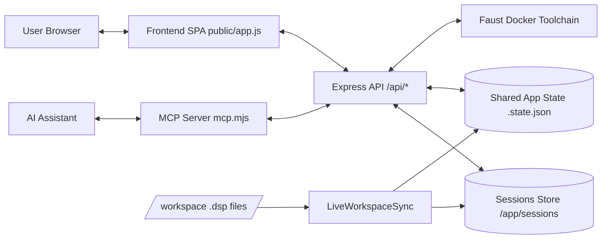

# faustforge Architecture

This document describes the current application architecture at a high level. It is intentionally short and implementation-oriented.

## 1) System Overview

faustforge is a Docker-first web application for Faust authoring, artifact generation, and live audio control.

At runtime it is composed of:

- a Node.js backend (Express API + static file server),
- a browser frontend (multi-view SPA),
- a sessions filesystem store (`/app/sessions`),
- a Faust toolchain container (`ghcr.io/orlarey/faustdocker:main`) invoked by backend routes,
- an MCP server (`mcp.mjs`) exposing the API to AI assistants via stdin/stdout,
- an optional live workspace mount (`/workspace`) for auto-discovered `.dsp` files.

## 2) Backend Architecture

Backend entrypoint:

- `src/server.ts`: creates the Express app, session manager, state store, API router, and starts live workspace sync.
- `src/index.ts`: process bootstrap.

Core backend runtime services:

- `SessionManager` (`src/sessions.ts`)
  - creates and manages static and live sessions,
  - stores session metadata and usage metrics,
  - resolves session files and ordering (chronological / usage).
- `StateStore` (`src/state.ts`)
  - persists global app state in `.state.json`,
  - tracks active session/view and run-scoped shared state.
- `LiveWorkspaceSync` (`src/live-workspace.ts`)
  - periodically scans workspace `.dsp` files,
  - creates/refreshes live sessions,
  - triggers analysis when content changes.
- Faust execution helpers (`src/docker.ts`)
  - runs Faust compilation/analysis commands in a dedicated container,
  - handles host/container path mapping (including Docker Desktop path normalization).
External integration process:

- MCP server (`mcp.mjs`)
  - runs in a separate process (typically in the same container),
  - communicates with AI clients via stdin/stdout,
  - calls the Express API over HTTP (`FAUST_HTTP_URL`) using the same public API surface as the browser frontend.

Route composition:

- `src/routes/api.ts` wires route groups and shared helpers.
- Route groups:
  - `session-lifecycle-routes.ts`: submit/list/use/live-open/live-refresh/edit-session.
  - `session-artifact-routes.ts`: artifact reads (source, cpp, svg, dot, errors).
  - `compile-download-routes.ts`: on-demand compile and downloads (including run/PWA bundle).
  - `app-state-routes.ts`: global shared app state (`GET/POST /api/state`).
  - `run-state-routes.ts`: run-specific control endpoints (`/run/*`).
  - `system-routes.ts`: version/help/system endpoints.

## 3) Frontend Architecture

Frontend entrypoint:

- `public/app.js`: SPA shell, session navigation, view switching, overlays, keyboard shortcuts, backend polling/sync.

State modules:

- `public/app/state.js`: shared frontend state constants and startup state.
- `public/app/helpers.js`, `public/app/ui-utils.js`: cross-view utility code.

View modules (`public/views/*.js`):

- `dsp`: source code view
- `cpp`: generated C++ view
- `svg`: block diagram view
- `tasks`: task graph view
- `signals`: signal graph view
- `run`: interactive audio runtime view (largest module)

Shared view helpers (`public/views/shared/*`):

- `code-editor-view.js`, `dot-view.js`, `text-utils.js` (common view rendering),
- `run-*` helper files for constants, params normalization, MIDI, scope, spectrum, utility math.

Frontend rendering model:

- `app.js` dynamically imports all views,
- only one active view is rendered at a time,
- each view exposes `getName`, `render`, `dispose`,
- cross-session state restoration is driven via `/api/state` and per-view local state.

## 4) Data and Persistence

### Session data

Each session lives under `/app/sessions/<sessionId>/` and may contain:

- `user_code.dsp`,
- generated artifacts (`generated.cpp`, `svg/*`, `signals.dot`, `tasks.dot`, wasm/webapp outputs),
- `metadata.json`,
- `errors.log`.

Session IDs:

- static sessions: SHA-1 of source content,
- live sessions: `live-<sha1>` derived from workspace file path/content metadata.

### Shared app state

`/app/sessions/.state.json` stores cross-view and cross-client shared state:

- active session and view,
- run parameter cells (`runParams`),
- run transport / trigger / midi commands,
- run polyphony,
- optional spectrum snapshots and summaries.

Effective run-sync model uses `{ v, d }` (value + timestamp) per path for arbitration.  
`owner` may still appear as an optional legacy field in persisted schema (`src/state.ts`), but current synchronization logic is ownerless (see `SPECIFICATION-RUN-PARAM-SYNC.md`).

## 5) Core Runtime Flows

### A) Submit new static session

1. Frontend posts source to `/api/submit`.
2. Backend creates session directory (or reuses existing session hash).
3. Backend runs Faust analysis (`src/docker.ts` + `analyzeFaust`).
4. Artifacts and compiler errors are persisted in session folder.
5. Frontend navigates to the resulting session and selected view.

### B) Live workspace sync

1. `LiveWorkspaceSync` scans `/workspace` at interval.
2. For changed `.dsp`, backend updates/creates live sessions.
3. Non-empty files trigger Faust analysis.
4. Most recently changed live session becomes active in shared state.
5. Frontend polling observes state/session updates and refreshes UI.

### C) Run view parameter sync

Current model (ownerless, timestamp-based):

1. Local UI intent updates local run param map `L`.
2. SYNC tick fetches backend snapshot `D` from `/api/state`.
3. Reconciliation computes `D'` per path using timestamps:
   - local wins on `>=`,
   - backend wins on `<`.
4. Local deltas are applied to DSP and UI through run view hub logic.
5. If `D' != D`, frontend publishes full reconciled snapshot to backend.
6. Backend merges per path by timestamp (equal timestamp => last POST received wins for that path).

### D) Artifact download

Downloads are view-scoped. Depending on active view, frontend calls corresponding API endpoint for:

- source text,
- generated C++,
- graph source/artifacts,
- run export bundle (PWA tarball).

## 6) Operational Topology

Default container:

- exposes HTTP on `:3000`,
- mounts sessions host directory to `/app/sessions`,
- mounts Docker socket to allow backend-triggered Faust toolchain container runs.

Optional live mode:

- mounts host workspace to `/workspace`,
- enables auto-discovery (`LIVE_AUTO_DISCOVER=1`),
- scan interval controlled by `LIVE_SCAN_INTERVAL_MS`.

User launcher scripts:

- macOS/Linux: `scripts/ff`, `scripts/install.sh`,
- Windows: `scripts/ff.ps1`, `scripts/ff.cmd`, `scripts/install.ps1`.

These scripts provide start/stop/update/status/logs/open commands and workspace-oriented startup ergonomics.

## 7) Extension Points

Recommended extension points:

- add new frontend views under `public/views/` (register automatically via `app.js` loader list),
- add new API route groups under `src/routes/`,
- extend run control protocol through `/run/*` endpoints and run-view integration,
- extend live workspace behavior in `LiveWorkspaceSync`,
- add export formats through `compile-download-routes.ts`.

Design constraints to preserve:

- keep session artifacts filesystem-based and deterministic,
- keep run param sync timestamp-driven and convergent,
- keep frontend views isolated (`render`/`dispose` contract),
- keep API boundaries explicit between lifecycle, artifacts, run state, and global app state.
