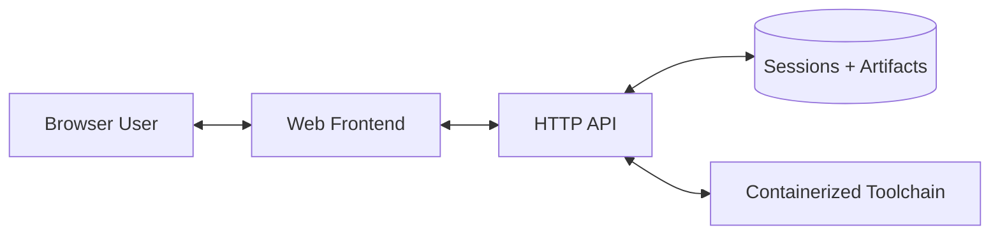

# Docker Web Tool Pattern

This document describes a reusable product/architecture pattern: a **pure Docker tool with a browser UI** where users drop files, navigate multiple views, and download generated outputs.

The pattern is extracted from faustforge, but it is domain-agnostic.

## 1) Core Idea

Build a self-contained tool with:

- one Docker image (or one main image + worker image),
- one web interface exposed on `http://localhost:<port>`,
- file-based sessions persisted on a mounted host folder,
- multiple generated artifacts represented as UI views,
- view-specific downloads.

From the user perspective:

1. Start container.
2. Open browser UI.
3. Drop source files.
4. Inspect generated views.
5. Download outputs.

No local SDK/toolchain should be required beyond Docker.

## 2) Product Contract

Every Docker Web Tool should provide the same simple contract:

- **Input**: user drops source files in browser.
- **Transform**: backend runs deterministic transformations in containerized toolchain.
- **Explore**: frontend exposes multiple read/run/inspect views.
- **Export**: each view provides explicit download formats.
- **Persist**: sessions and generated artifacts survive restart via mounted volume.

This contract is independent from the domain (audio, docs, codegen, data processing, etc.).

## 3) Reference Architecture



### Components

- **Frontend SPA**
  - drag-and-drop/paste entrypoint,
  - session list + view switcher,
  - per-view action bar (refresh/download/help),
  - lightweight state sync with backend.

- **Backend API**
  - session lifecycle (`create/list/open/delete`),
  - artifact build/update endpoints,
  - download endpoints,
  - shared app state endpoint (active session/view, runtime controls if needed).

- **Session Store (filesystem)**
  - source files,
  - metadata,
  - generated artifacts,
  - build logs/errors.

- **Toolchain Runner**
  - executes domain compiler/converter in Docker,
  - isolates host environment,
  - keeps input/output paths deterministic.

## 4) Session Model

A session is a directory:

```text
sessions/<session-id>/
  source.ext
  metadata.json
  artifacts/...
  errors.log
```

Recommended metadata fields:

- `id`, `filename`, `created_at`, `updated_at`
- `source_hash`
- optional usage metrics (`last_used_at`, `usage_score`)
- optional tool options used to generate artifacts

Rule: artifact generation should be reproducible from session source + stored options.

## 5) View Model

A view is a projection of the same session:

- `source` view: raw input text/file
- `intermediate` views: transformed documents/graphs/code
- `final` view: preview of target output
- optional `runtime` view for interactive tools

Each view defines:

- render endpoint(s),
- refresh behavior,
- download format(s),
- empty/error fallback.

## 6) Build/Refresh Strategy

Recommended strategy:

- On submit/drop: create or reuse session from content hash.
- On refresh: rebuild all dependent artifacts for current session.
- On view switch: avoid unnecessary rebuilds when artifacts are already up to date.
- Store compiler/converter stderr in `errors.log`.

For expensive pipelines, support:

- incremental rebuild,
- per-artifact cache,
- “stale/dirty” markers.

## 7) Deployment Pattern

### For users

- one-line installer (`curl|bash` or PowerShell),
- simple launcher command (`ff`-style CLI):
  - `start`, `stop`, `update`, `status`, `logs`, `open`.

### For operators

- Docker image versioning,
- mounted persistent sessions directory,
- optional mounted workspace directory for auto-discovery/live mode.

## 8) Design Principles

- **Docker-only runtime**: no local toolchain install.
- **Browser-first UX**: drag/drop + immediate visual feedback.
- **Deterministic filesystem state**: session folders are the source of truth.
- **Explicit downloads**: export depends on active view, never ambiguous.
- **Progressive complexity**: simple default flow, advanced options hidden but available.

## 9) Example: Markdown Forge (future tool)

A non-musical variant of faustforge:

- Input: dropped `.md` files.
- Toolchain: Pandoc (and optional LaTeX engine) in Docker.
- Views:
  - `markdown` (source),
  - `html` preview,
  - `pdf` preview metadata/log,
  - optional `ast`/structure view.
- Downloads:
  - `.md`,
  - `.html`,
  - `.pdf`,
  - optional packaged export (`.tar.gz`).

Possible session artifact tree:

```text
sessions/<id>/
  source.md
  metadata.json
  output.html
  output.pdf
  errors.log
```

Same platform pattern, different domain compiler.

## 10) Minimal Implementation Checklist

- API endpoints:
  - `POST /submit`
  - `GET /sessions`
  - `POST /:id/refresh`
  - `GET /:id/<artifact>`
  - `GET /:id/download/<format>`
- Frontend:
  - drop zone
  - session navigation
  - view selector
  - per-view download control
- Persistence:
  - mounted sessions folder
- Tooling:
  - Dockerized converter/compiler execution
- UX:
  - clear error panel from `errors.log`
  - loading state per view

This is the general Docker Web Tool pattern that faustforge instantiates.

