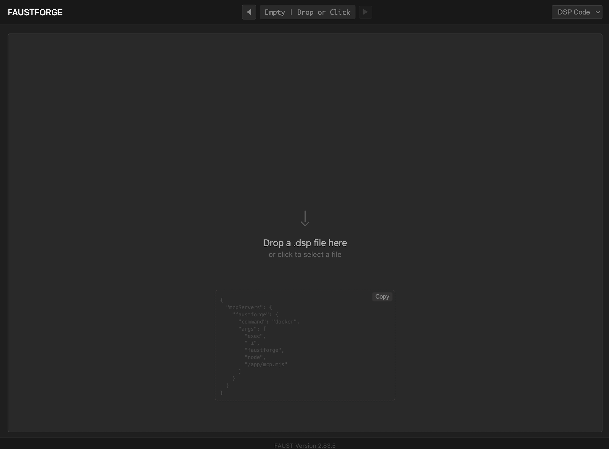
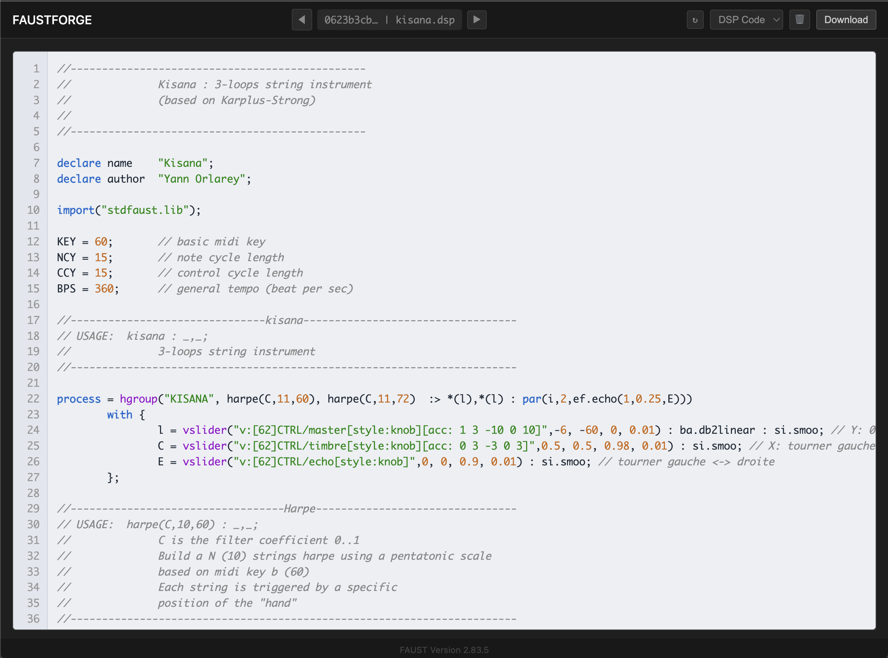
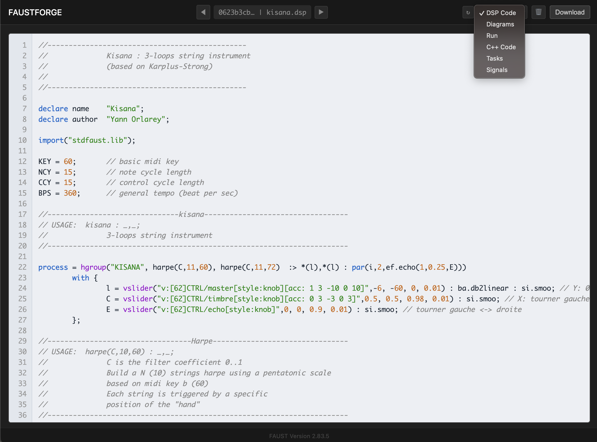
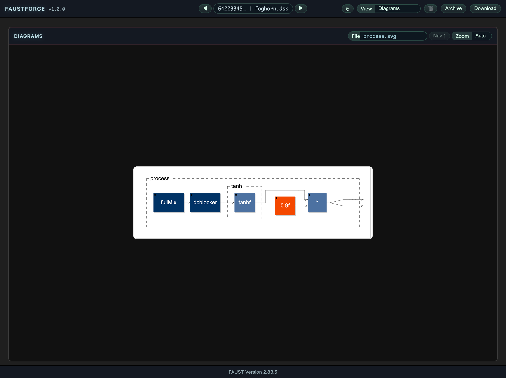
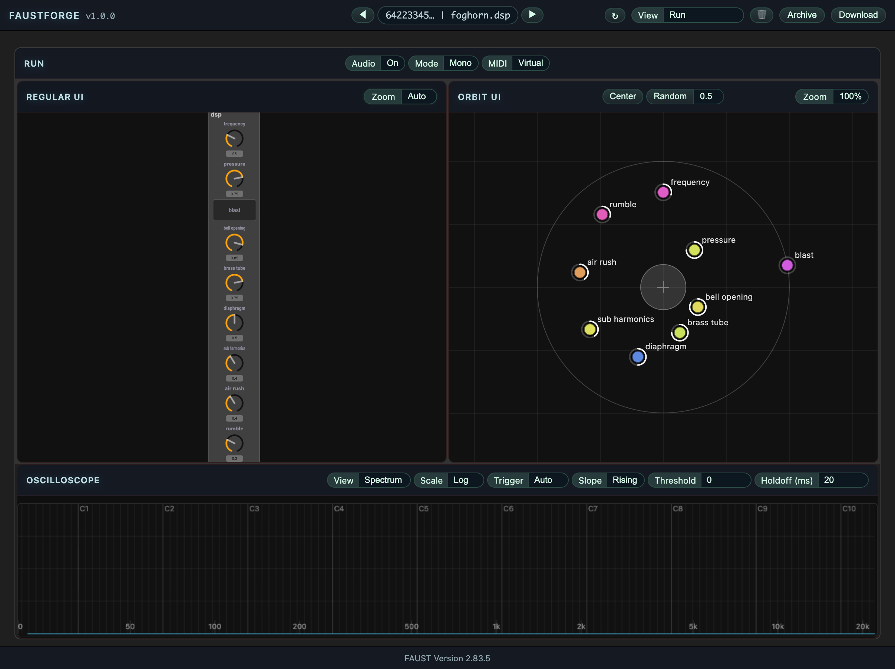
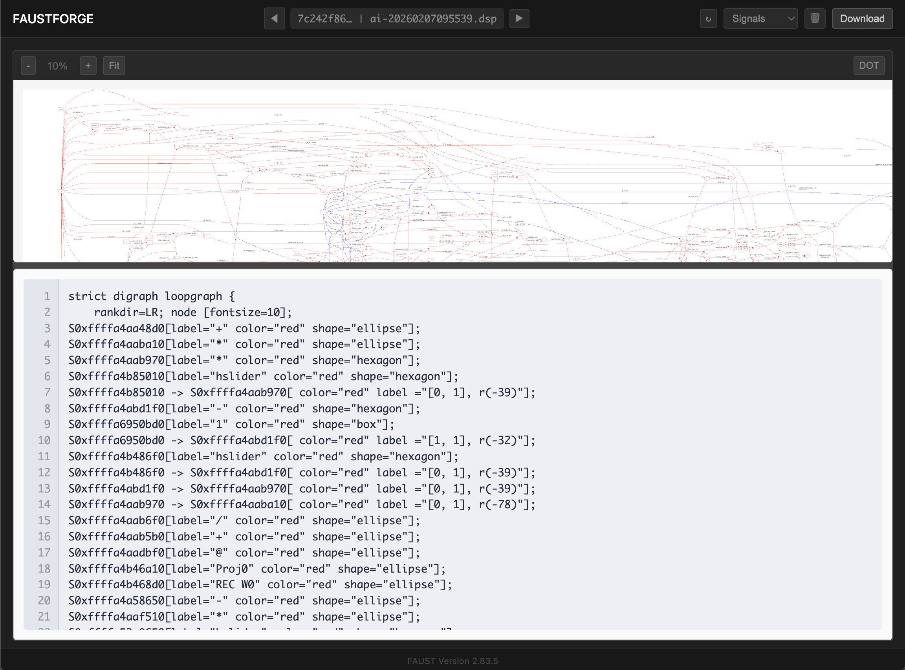

# faustforge
Web UI + MCP server for Faust prototyping, intended to run with Docker.

## Quick Start (Docker)

Prerequisite: Docker installed and running.

### 1) Run the container

```bash
docker run -d \
  --name faustforge \
  -p 3000:3000 \
  -v "$HOME/.faustforge/sessions:/app/sessions" \
  -v /var/run/docker.sock:/var/run/docker.sock \
  -e SESSIONS_DIR=/app/sessions \
  -e HOST_SESSIONS_DIR="$HOME/.faustforge/sessions" \
  -e FAUST_HTTP_URL=http://localhost:3000 \
  ghcr.io/orlarey/faustforge:latest
```

`docker run` pulls the image automatically if it is not present locally.
To force the latest image: `docker pull ghcr.io/orlarey/faustforge:latest` (or `docker run --pull always ...` if supported).

Then open:

```text
http://localhost:3000
```

Notes:
- Sessions are persisted in `~/.faustforge/sessions`.
- `/var/run/docker.sock` is required because the app launches the Faust Docker image for C++ compilation.
- `HOST_SESSIONS_DIR` must point to the host path of sessions so nested Docker mounts resolve correctly.

Optional overrides:

```bash
docker run -d \
  --name faustforge-dev \
  -p 3001:3000 \
  -v "$HOME/.faustforge-dev/sessions:/app/sessions" \
  -v /var/run/docker.sock:/var/run/docker.sock \
  -e SESSIONS_DIR=/app/sessions \
  -e HOST_SESSIONS_DIR="$HOME/.faustforge-dev/sessions" \
  -e FAUST_HTTP_URL=http://localhost:3001 \
  ghcr.io/orlarey/faustforge:latest
```

### Windows (PowerShell)

```powershell
$sessions = "$env:USERPROFILE\.faustforge\sessions"
New-Item -ItemType Directory -Force -Path $sessions | Out-Null

docker run -d `
  --name faustforge `
  -p 3000:3000 `
  -v "${sessions}:/app/sessions" `
  -v /var/run/docker.sock:/var/run/docker.sock `
  -e SESSIONS_DIR=/app/sessions `
  -e HOST_SESSIONS_DIR="$sessions" `
  -e FAUST_HTTP_URL=http://localhost:3000 `
  ghcr.io/orlarey/faustforge:latest
```

Then open `http://localhost:3000`.

## User Manual

### 1) Open faustforge

Open `http://localhost:3000`.



### 2) Create a session

You can:

- Drop a `.dsp` file into the page.
- Paste Faust code directly (`Ctrl+V` / `Cmd+V`), which creates a `clip-<timestamp>.dsp` session.



### 3) Navigate sessions and views

- Sessions: `◀` / `▶`
- Views menu order: `dsp`, `svg`, `run`, `cpp`, `tasks`, `signals`
- Keyboard shortcuts:
  - `←` / `→`: previous/next session
  - `↑` / `↓`: previous/next view



### 4) Work with source and generated outputs

- `dsp`: original Faust source
- `cpp`: generated C++
- `svg`: Faust diagram SVG



### 5) Run audio

Go to `run` view to:

- start/stop audio
- interact with controls
- use MCP tools against the same active session



### 6) Analyze graphs

- `tasks`: DOT graph from `faust -vec -tg`
- `signals`: DOT graph from `faust -sg`

Use `DOT` button to show source.  
If SVG rendering fails (large graph), faustforge shows an error banner and switches to DOT-focused fallback.



### 7) Refresh and download

- `↻` refresh: regenerate session artifacts from current source
- `Download` exports content for the current view

## Build Locally (Maintainers)

### 1) Build the local image

```bash
make rebuild
```

### 2) Run with helper script

```bash
make run
```

The helper script uses:

- `PORT` (default `3000`)
- `NAME` (default `faustforge`)
- `HOST_SESSIONS_DIR` (default `$HOME/.faustforge/sessions`)

You can still use the raw scripts directly:
- `./scripts/rebuild.sh`
- `./scripts/run.sh`
- `./scripts/stop.sh`

## Claude Desktop MCP Setup

Edit:

```text
~/Library/Application Support/Claude/claude_desktop_config.json
```

Add:

```json
{
  "mcpServers": {
    "faustforge": {
      "command": "docker",
      "args": ["exec", "-i", "faustforge", "node", "/app/mcp.mjs"]
    }
  }
}
```

Restart Claude Desktop.

## Using Faustforge with an AI client

With MCP configured, Claude Desktop can control Faustforge and work on the same sessions as the web UI.

What the AI can do:
- Forge: submit/edit Faust DSP code and inspect generated artifacts.
- Play: switch to `run`, start/stop audio transport, and control UI parameters.
- Analyze: capture and read spectrum snapshots to evaluate sonic changes.

Typical workflow:
```text
1) get_onboarding_guide()
2) set_view("run")
3) get_run_ui()
4) run_transport("start")
5) set_run_param(...)
6) set_run_param_and_get_spectrum(...)
7) trigger_button_and_get_spectrum(...)
8) analyze series and aggregate.summary
9) iterate on DSP or parameters
```

Run control tools:
- `get_onboarding_guide()` -> best-practice workflow + thresholds for autonomous AI behavior
- `get_run_ui` -> return Faust UI JSON (parameter paths)
- `get_run_params` -> return current run parameters by path
- `get_polyphony()` -> get current polyphony (`0` means mono)
- `set_polyphony(voices)` -> set polyphony (`0,1,2,4,8,16,32,64`; `0` means mono)
- `set_run_param(path, value)` -> set one continuous parameter
- `set_run_param_and_get_spectrum(path, value, settleMs?, captureMs?, sampleEveryMs?, maxFrames?)` -> set parameter + capture spectrum-summary time series + max-hold aggregate
- `run_transport(action)` -> `start`, `stop`, or `toggle`
- `trigger_button(path, holdMs?)` -> safe press/release cycle
- `trigger_button_and_get_spectrum(path, holdMs?, captureMs?, sampleEveryMs?, maxFrames?)` -> trigger + spectrum-summary time series + max-hold aggregate
- `midi_note_on(note, velocity?)` -> send MIDI note-on
- `midi_note_off(note)` -> send MIDI note-off
- `midi_note_pulse(note, velocity?, holdMs?)` -> send note-on then note-off automatically
- `midi_note_on_and_get_spectrum(note, velocity?, settleMs?, captureMs?, sampleEveryMs?, maxFrames?)` -> note-on + spectrum-summary time series + max-hold aggregate
- `midi_note_off_and_get_spectrum(note, settleMs?, captureMs?, sampleEveryMs?, maxFrames?)` -> note-off + spectrum-summary time series + max-hold aggregate
- `midi_note_pulse_and_get_spectrum(note, velocity?, holdMs?, captureMs?, sampleEveryMs?, maxFrames?)` -> note-pulse + spectrum-summary time series + max-hold aggregate

Faust library documentation tools:
- The Docker image ships with a prebuilt Faust doc index generated from `faustwasm` stdlib (`/usr/share/faust/stdfaust.lib`).
- No runtime fallback: MCP expects this prebuilt index to be present in the image.
- `search_faust_lib(query, limit?, module?)` -> search symbols without loading full docs in context
- `get_faust_symbol(symbol)` -> full symbol entry (summary, usage, params, test snippet, source)
- `list_faust_module(module, limit?)` -> list symbols from one module (e.g. `delays`, `filters`)
- `get_faust_examples(symbolOrModule, limit?)` -> retrieve test/example snippets
- `explain_faust_symbol_for_goal(symbol, goal)` -> action-oriented guidance for a concrete DSP objective

Spectrum behavior:
- When audio is running in `run` view, the frontend pushes compact spectrum summaries to MCP state.
- `get_view_content` returns spectrum content when current view is `run`.
- `get_spectrum` returns the latest spectrum summary independently of current view.
- Capture starts at tool call time (only fresh snapshots are aggregated).
- Legacy fallback remains available when summary is not present.
- `spectrum_summary_v1` can include `audioQuality` feedback for temporal defects:
  - `peakDbFSQ`, `clipSampleCount`, `clipRatioQ`, `dcOffsetQ`, `clickCount`, `clickScoreQ`.

Audio quality quick interpretation (practical thresholds):
- `clipRatioQ > 1` (per-mille) -> clipping is likely audible.
- `clipRatioQ > 5` -> severe clipping.
- `clickScoreQ > 20` -> potential click/pop artifacts.
- `clickScoreQ > 40` -> strong click risk (usually clearly audible).
- `peakDbFSQ >= -1` with high `clipRatioQ` -> limiter/saturation region.

Browser note:
- On page open, faustforge requires an explicit `Enable Audio` click to unlock WebAudio in this tab.
- MCP audio tools (`run_transport start/toggle`, trigger/capture tools) are blocked until this unlock step is done.

Parameter behavior:
- `hslider`, `vslider`, `nentry`: value persists until changed.
- `button`: requires a full cycle (`1` then `0`) to retrigger correctly.
- `checkbox`: toggles between `0` and `1`, value persists.

Signals view:
- `signals` displays the Faust signal graph rendered from `signals.dot` (`faust -sg`).
- In `signals` view, Download exports `<name>-sig.dot`.

## Useful Docker Commands

```bash
make help
make logs
make stop
```

## Published Image

```text
ghcr.io/orlarey/faustforge:latest
```
