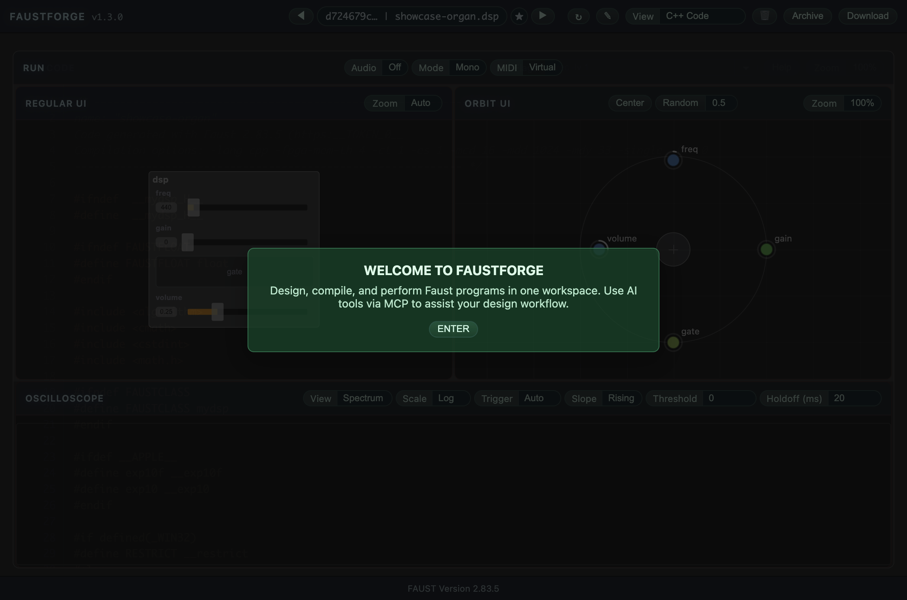
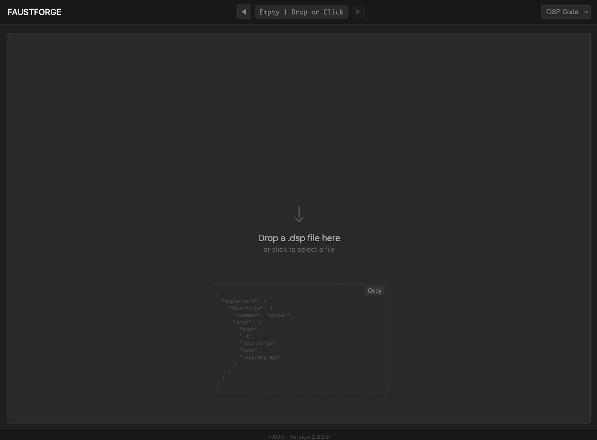
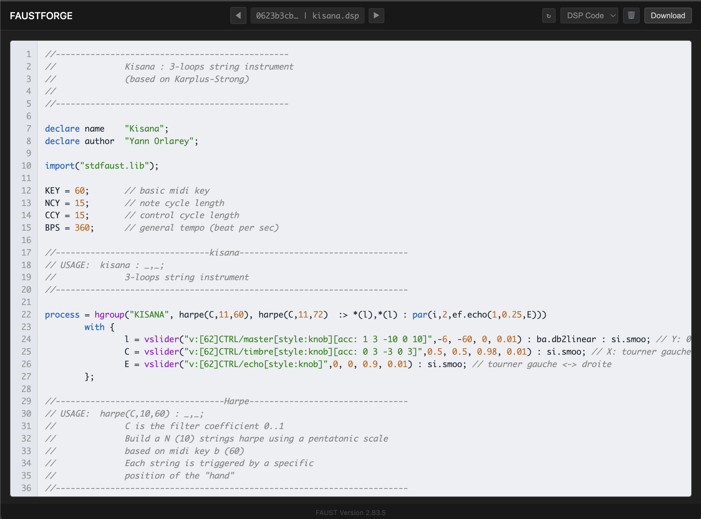
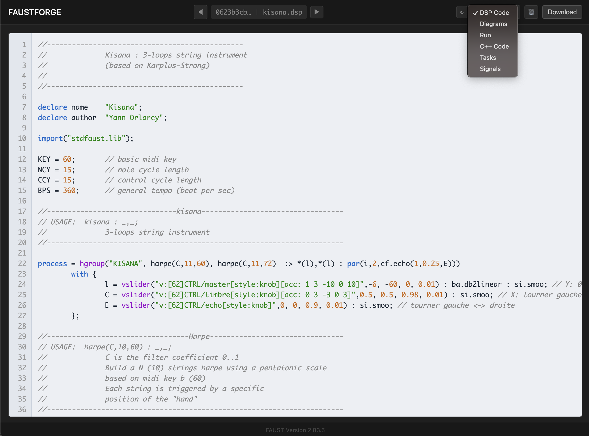
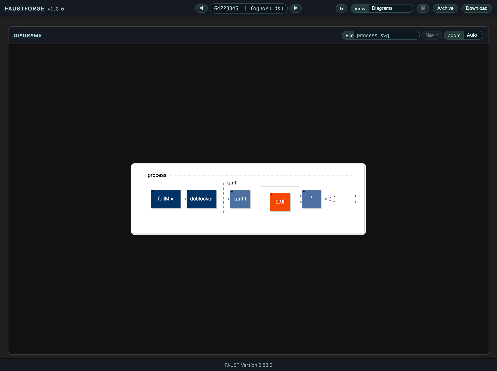
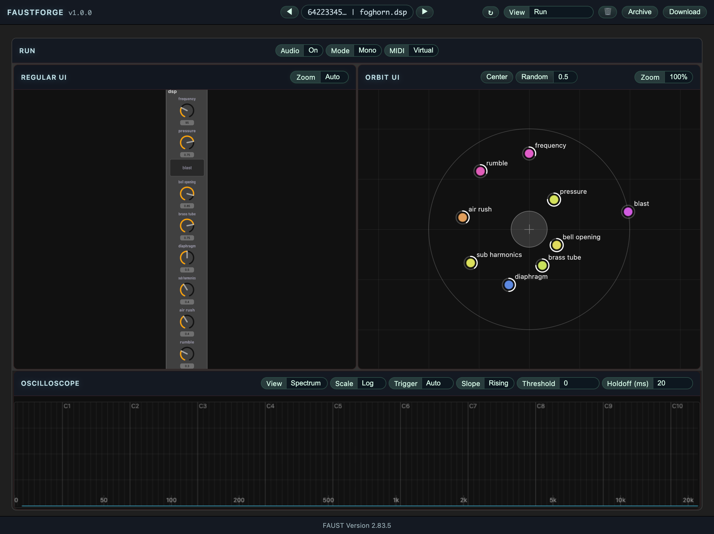
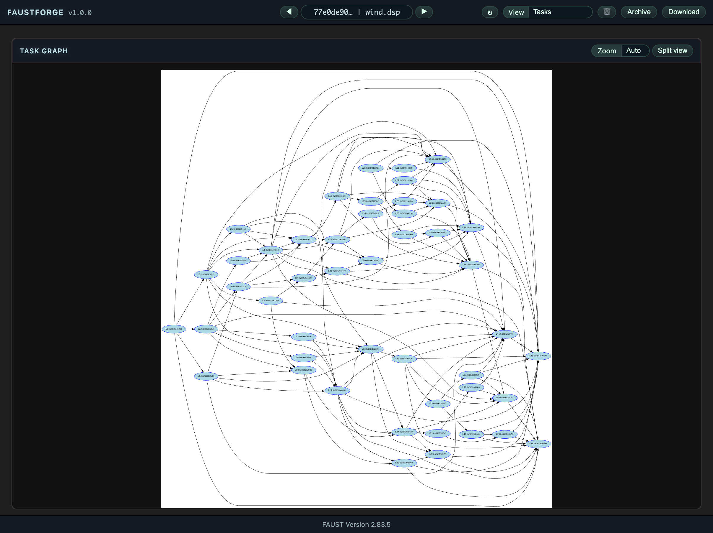
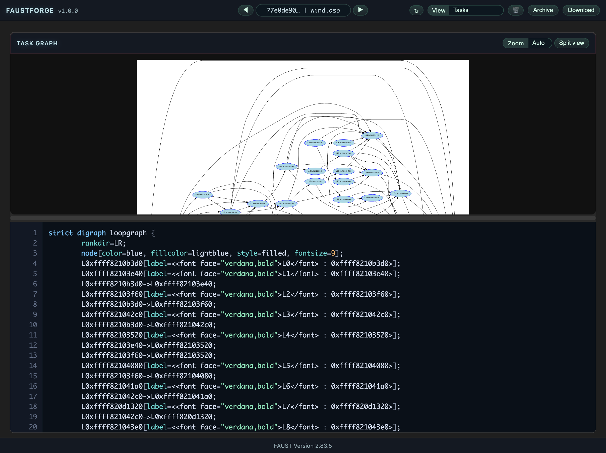
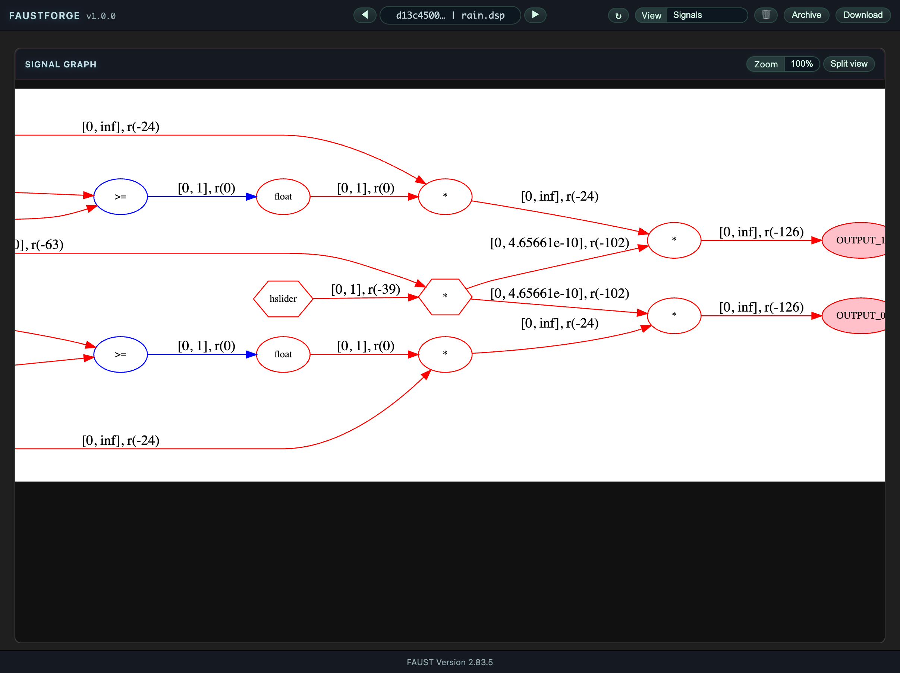
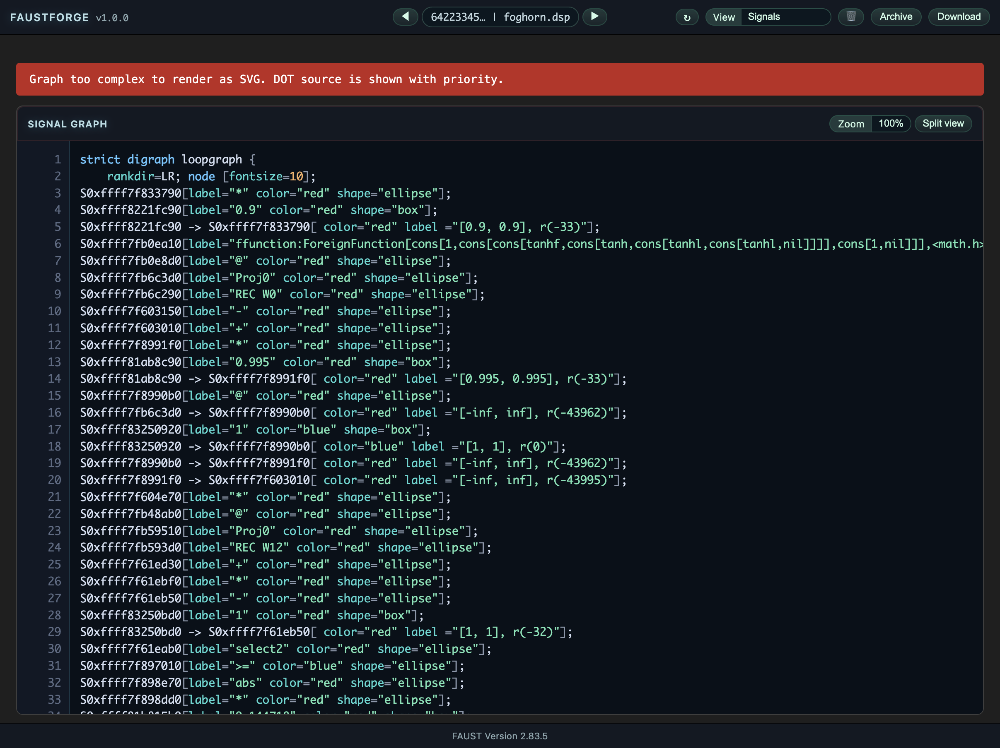

# faustforge
Docker-first web UI + MCP server for Faust prototyping, featuring an Orbit UI for expressive multi-parameter exploration and tight AI-in-the-loop iteration.

## Quick Start (Docker)

Prerequisite: Docker installed and running.

### 1) Run the container (standard mode)

```bash
docker run -d \
  --name faustforge \
  -p 3000:3000 \
  -v "$HOME/.faustforge/sessions:/app/sessions" \
  -v /var/run/docker.sock:/var/run/docker.sock \
  -e SESSIONS_DIR=/app/sessions \
  -e HOST_SESSIONS_DIR="$HOME/.faustforge/sessions" \
  -e FAUST_HTTP_URL=http://localhost:3000 \
  ghcr.io/orlarey/faustforge:latest
```

`docker run` pulls the image automatically if it is not present locally.
To force the latest image: `docker pull ghcr.io/orlarey/faustforge:latest` (or `docker run --pull always ...` if supported).

Then open:

```text
http://localhost:3000
```

Notes:
- Sessions are persisted in `~/.faustforge/sessions`.
- `SESSIONS_DIR` is the in-container path used by faustforge for session storage. It must match the container side of the sessions volume mount (`/app/sessions`).
- `FAUST_HTTP_URL` is the base HTTP URL used by internal components (including MCP in the container) to call the faustforge API.
- `/var/run/docker.sock` is required because the app launches the Faust Docker image for C++ compilation.
- `HOST_SESSIONS_DIR` must point to the host path of sessions so nested Docker mounts resolve correctly.

### 2) Run the container (live workspace mode)

Use this mode if you want:
- automatic recompilation when `.dsp` files change on disk
- automatic switch to newly discovered `.dsp` files (same behavior as dropping a file in the UI)

```bash
docker run -d \
  --name faustforge \
  -p 3000:3000 \
  -v "$HOME/.faustforge/sessions:/app/sessions" \
  -v "$HOME/faust-workspace:/workspace" \
  -v /var/run/docker.sock:/var/run/docker.sock \
  -e SESSIONS_DIR=/app/sessions \
  -e HOST_SESSIONS_DIR="$HOME/.faustforge/sessions" \
  -e FAUST_HTTP_URL=http://localhost:3000 \
  -e LIVE_AUTO_DISCOVER=1 \
  -e LIVE_WORKSPACE_ROOT=/workspace \
  -e HOST_LIVE_WORKSPACE_ROOT="$HOME/faust-workspace" \
  -e LIVE_SCAN_INTERVAL_MS=1500 \
  ghcr.io/orlarey/faustforge:latest
```

Then open:

```text
http://localhost:3000
```

In this setup, `.dsp` files under the mounted workspace are discovered automatically.
When a `.dsp` file appears or is modified, it is auto-opened and becomes the active session.
This matches the helper script default workspace path: `$HOME/faust-workspace`.

Notes:
- `LIVE_AUTO_DISCOVER=1` enables periodic scan of `.dsp` files under `LIVE_WORKSPACE_ROOT`.
- `LIVE_WORKSPACE_ROOT` must match the container side of the workspace mount (`/workspace` in this example).
- `LIVE_SCAN_INTERVAL_MS` controls detection/refresh latency (default `1500` ms).
- Use `LIVE_AUTO_DISCOVER=0` to disable live workspace behavior.

Optional overrides:

```bash
docker run -d \
  --name faustforge-dev \
  -p 3001:3000 \
  -v "$HOME/.faustforge-dev/sessions:/app/sessions" \
  -v /var/run/docker.sock:/var/run/docker.sock \
  -e SESSIONS_DIR=/app/sessions \
  -e HOST_SESSIONS_DIR="$HOME/.faustforge-dev/sessions" \
  -e FAUST_HTTP_URL=http://localhost:3001 \
  ghcr.io/orlarey/faustforge:latest
```

### 3) Windows (PowerShell, standard mode)

```powershell
$sessions = "$env:USERPROFILE\.faustforge\sessions"
New-Item -ItemType Directory -Force -Path $sessions | Out-Null

docker run -d `
  --name faustforge `
  -p 3000:3000 `
  -v "${sessions}:/app/sessions" `
  -v /var/run/docker.sock:/var/run/docker.sock `
  -e SESSIONS_DIR=/app/sessions `
  -e HOST_SESSIONS_DIR="$sessions" `
  -e FAUST_HTTP_URL=http://localhost:3000 `
  ghcr.io/orlarey/faustforge:latest
```

Then open `http://localhost:3000`.

## User Manual

### 1) Open faustforge

Open `http://localhost:3000`. On startup, faustforge shows a welcome overlay with a rotating showcase session in the background. Click **ENTER** to unlock audio for the current browser tab (required by Web Audio API security policy) and switch to the **Empty** session.



Once audio is unlocked, you can start creating sessions by dropping Faust files.



### 2) Create a session

A session is a Faust `.dsp` code associated with different views, including a run view where you can listen to and interact with the audio application.

In order to create a session you can:

- Drop a `.dsp` file into the page.
- Paste Faust code directly (`Ctrl+V` / `Cmd+V`), which creates a `clip-<timestamp>.dsp` session.

Note that you can create new sessions from any session and any view. For example, if you are in the block diagram view, you can drop a `.dsp` file to visualize its block diagram.



### 2.1) Live sessions (workspace mode)

When `LIVE_AUTO_DISCOVER=1` is enabled and a host folder is mounted to `LIVE_WORKSPACE_ROOT`:

- Every `.dsp` file found under that workspace is tracked as a **live session**.
- Saving changes to a tracked `.dsp` file triggers automatic live refresh/recompilation.
- Creating or modifying a `.dsp` file automatically opens it and makes it the active session (same behavior as dropping a file in the UI).
- Live session IDs are stable for a given file path (moving/renaming a file creates a different live session ID).
- Empty live files are treated as **draft** sessions: compilation is skipped until content is non-empty.
- In draft mode, faustforge forces `dsp` view and other views are temporarily disabled.

Operational notes:

- Scan cadence is controlled by `LIVE_SCAN_INTERVAL_MS` (default: `1500` ms).
- Auto-discovery can be disabled with `LIVE_AUTO_DISCOVER=0`.
- The regular **Refresh** button still works and forces regeneration for the currently selected session.

### 3) Navigate sessions and views

You can navigate between sessions using the left and right arrows, and between views using the up and down arrows or the view menu.

- Sessions: `◀` / `▶`
- Click the session label to open the session picker popup (direct jump + search).
- Session picker order modes:
  - `⏱ Chronological`: newest at top, oldest at bottom.
  - `★ Usage`: highest cumulative usage score first.
- The current session is marked with a checkmark in the popup.
- Views menu order: `dsp`, `svg`, `run`, `cpp`, `tasks`, `signals`
- Keyboard shortcuts:
  - `←` / `→`: previous/next session
  - `↑` / `↓`: previous/next view



### 4) Work with source and generated outputs

The following views let you inspect the Faust source and its generated artifacts:

- `dsp`: original Faust source code.
- `svg`: block diagram rendered as SVG.
- `cpp`: generated C++ code.
- `tasks`: task-level parallelism graph (see section 6).
- `signals`: internal signal graph (see section 6).

The `run` view is covered in detail in the next section.



### 5) Run audio

Go to `run` view to:

- start/stop audio
- view the produced spectrum or waveform
- interact with controls in `Regular UI` and `Orbit UI`
- play notes from the virtual MIDI keyboard in the top bar (`A W S E D F T G Y H U J`, octave `Z/X`)
- use MCP tools against the same active session



#### Orbit UI behavior

Orbit UI is a 2D control space for fast exploration of many parameters at once.

- Each slider is an icon around a central point.
- Slider value depends on icon distance to center:
  - on/inside inner disk: maximum
  - outside outer circle: minimum
  - between both: linear interpolation
- Drag a slider icon: changes only this slider (if active).
- Drag the center: changes all active sliders at once.
- Drag the outer circle ring (`grab` cursor): changes outer radius and updates all active sliders.
- `Shift+click` an icon: toggle slider active/disabled.
  - disabled slider is shown in dark gray
  - can move visually, but does not affect DSP parameter
  - ignored by center/radius gestures
  - ignored by parameter-to-orbit sync
- In polyphonic mode, Orbit auto-disables only sliders matching `freq`, `gate`, or `gain`.

### 6) Analyze graphs

These two views give access to internal representations used by the Faust compiler:

- `tasks`: task-level parallelism graph generated by `faust -vec -tg`. It shows how the compiler splits computation into parallel tasks.
- `signals`: signal-level graph generated by `faust -sg`. It shows the internal signal expression tree before compilation.

#### Tasks graph



Click the **Split view** button to show the `.dot` source code side by side with the rendered graph.



#### Signals graph



#### Large graph fallback

If SVG rendering fails (typically because the graph is too large), faustforge displays an error banner and automatically switches to a DOT-only fallback view where you can still read and download the `.dot` source.




### 7) Toolbar actions

- **Refresh** (`↻`): regenerates all session artifacts (C++, SVG, graphs) from the current Faust source. Use this after editing the `.dsp` code.
- **Download**: exports the content of the current view. The exported format depends on the active view:
  - `dsp` → `<name>.dsp` (Faust source)
  - `svg` → `<name>-svg.tar.gz` (SVG export bundle)
  - `cpp` → `<name>.cpp` (generated C++ code)
  - `tasks` → `<name>.dsp.dot` (tasks graph in DOT format)
  - `signals` → `<name>-sig.dot` (signals graph in DOT format)
  - `run` → `<name>-pwa.tar.gz` (generated runnable web app bundle)
- **Delete**: deletes the current session and all its associated artifacts. The next available session is automatically selected.
- **Edit** (`✎`, static sessions only): copies the static source into the live shared workspace root and opens the host editor URL when available (for example `vscode://file/...`).
- **Archive**: downloads all sessions as a single `.tar.gz` archive. This is useful for backing up your work or transferring sessions to another machine.

## Build Locally (Maintainers)

### 1) Build the local image

```bash
make rebuild
```

### 2) Run with helper script

```bash
make run
```

The helper script uses:

- `PORT` (default `3000`)
- `NAME` (default `faustforge`)
- `HOST_SESSIONS_DIR` (default `$HOME/.faustforge/sessions`)
- `LIVE_AUTO_DISCOVER` (optional, default `1`, set `0` to disable workspace auto-discovery)
- `LIVE_WORKSPACE_ROOT` (optional, default `/workspace`)
- `HOST_LIVE_WORKSPACE_ROOT` (optional, host path matching `LIVE_WORKSPACE_ROOT`, needed for `Edit` button editor URL)
- `LIVE_SCAN_INTERVAL_MS` (optional, default `1500`)
- `LIVE_IGNORE_DIRS` (optional CSV list, example: `.git,node_modules,build`)
- `MAX_SESSIONS` (optional, default `0` = unlimited; set `>0` to re-enable cap/eviction)

You can still use the raw scripts directly:
- `./scripts/rebuild.sh`
- `./scripts/run.sh`
- `./scripts/stop.sh`

### Optional: Live workspace mode in Docker

To auto-create/update live sessions from files saved in a mounted workspace:

```bash
docker run -d \
  --name faustforge \
  -p 3000:3000 \
  -v "$HOME/.faustforge/sessions:/app/sessions" \
  -v "$HOME/faust-workspace:/workspace" \
  -v /var/run/docker.sock:/var/run/docker.sock \
  -e SESSIONS_DIR=/app/sessions \
  -e HOST_SESSIONS_DIR="$HOME/.faustforge/sessions" \
  -e FAUST_HTTP_URL=http://localhost:3000 \
  -e LIVE_AUTO_DISCOVER=1 \
  -e LIVE_WORKSPACE_ROOT=/workspace \
  -e HOST_LIVE_WORKSPACE_ROOT="$HOME/faust-workspace" \
  -e LIVE_SCAN_INTERVAL_MS=1500 \
  faustforge:latest
```

## Claude Desktop MCP Setup

Edit:

```text
~/Library/Application Support/Claude/claude_desktop_config.json
```

Add:

```json
{
  "mcpServers": {
    "faustforge": {
      "command": "docker",
      "args": ["exec", "-i", "faustforge", "node", "/app/mcp.mjs"]
    }
  }
}
```

Restart Claude Desktop.

## Using Faustforge with an AI client

With MCP configured, Claude Desktop can control Faustforge and work on the same sessions as the web UI.

What the AI can do:
- Forge: submit/edit Faust DSP code and inspect generated artifacts.
- Play: switch to `run`, start/stop audio transport, and control UI parameters.
- Analyze: capture and read spectrum snapshots to evaluate sonic changes.

Typical workflow:
```text
1) get_onboarding_guide()
2) set_view("run")
3) get_run_ui()
4) run_transport("start")
5) set_run_param(...)
6) set_run_param_and_get_spectrum(...)
7) trigger_button_and_get_spectrum(...)
8) analyze series and aggregate.summary
9) iterate on DSP or parameters
```

Run control tools:
- `get_onboarding_guide()` -> best-practice workflow + thresholds for autonomous AI behavior
- `get_run_ui` -> return Faust UI JSON (parameter paths)
- `get_run_params` -> return current run parameters by path
- `get_polyphony()` -> get current polyphony (`0` means mono)
- `set_polyphony(voices)` -> set polyphony (`0,1,2,4,8,16,32,64`; `0` means mono)
- `set_run_param(path, value)` -> set one continuous parameter
- `set_run_param_and_get_spectrum(path, value, settleMs?, captureMs?, sampleEveryMs?, maxFrames?)` -> set parameter + capture spectrum-summary time series + max-hold aggregate
- `run_transport(action)` -> `start`, `stop`, or `toggle`
- `trigger_button(path, holdMs?)` -> safe press/release cycle
- `trigger_button_and_get_spectrum(path, holdMs?, captureMs?, sampleEveryMs?, maxFrames?)` -> trigger + spectrum-summary time series + max-hold aggregate
- `midi_note_on(note, velocity?)` -> send MIDI note-on
- `midi_note_off(note)` -> send MIDI note-off
- `midi_note_pulse(note, velocity?, holdMs?)` -> send note-on then note-off automatically
- `midi_note_on_and_get_spectrum(note, velocity?, settleMs?, captureMs?, sampleEveryMs?, maxFrames?)` -> note-on + spectrum-summary time series + max-hold aggregate
- `midi_note_off_and_get_spectrum(note, settleMs?, captureMs?, sampleEveryMs?, maxFrames?)` -> note-off + spectrum-summary time series + max-hold aggregate
- `midi_note_pulse_and_get_spectrum(note, velocity?, holdMs?, captureMs?, sampleEveryMs?, maxFrames?)` -> note-pulse + spectrum-summary time series + max-hold aggregate

Faust library documentation tools:
- The Docker image ships with a prebuilt Faust doc index generated from `faustwasm` stdlib (`/usr/share/faust/stdfaust.lib`).
- No runtime fallback: MCP expects this prebuilt index to be present in the image.
- `search_faust_lib(query, limit?, module?)` -> search symbols without loading full docs in context
- `get_faust_symbol(symbol)` -> full symbol entry (summary, usage/signature, params, io with `inSignals`/`outSignals` when derivable, test snippet, source)
- `list_faust_module(module, limit?)` -> list symbols from one module (e.g. `delays`, `filters`)
- `get_faust_examples(symbolOrModule, limit?)` -> retrieve test/example snippets
- `explain_faust_symbol_for_goal(symbol, goal)` -> action-oriented guidance for a concrete DSP objective

Spectrum behavior:
- When audio is running in `run` view, the frontend pushes compact spectrum summaries to MCP state.
- `get_view_content` returns spectrum content when current view is `run`.
- `get_spectrum` returns the latest spectrum summary independently of current view.
- Capture starts at tool call time (only fresh snapshots are aggregated).
- Legacy fallback remains available when summary is not present.
- `spectrum_summary_v1` can include `audioQuality` feedback for temporal defects:
  - `peakDbFSQ`, `clipSampleCount`, `clipRatioQ`, `dcOffsetQ`, `clickCount`, `clickScoreQ`.

Audio quality quick interpretation (practical thresholds):
- `clipRatioQ > 1` (per-mille) -> clipping is likely audible.
- `clipRatioQ > 5` -> severe clipping.
- `clickScoreQ > 20` -> potential click/pop artifacts.
- `clickScoreQ > 40` -> strong click risk (usually clearly audible).
- `peakDbFSQ >= -1` with high `clipRatioQ` -> limiter/saturation region.

Browser note:
- On page open, faustforge requires an explicit `ENTER` click to unlock WebAudio in this tab.
- MCP audio tools (`run_transport start/toggle`, trigger/capture tools) are blocked until this unlock step is done.

Parameter behavior:
- `hslider`, `vslider`, `nentry`: value persists until changed.
- `button`: requires a full cycle (`1` then `0`) to retrigger correctly.
- `checkbox`: toggles between `0` and `1`, value persists.

Signals view:
- `signals` displays the Faust signal graph rendered from `signals.dot` (`faust -sg`).
- In `signals` view, Download exports `<name>-sig.dot`.

## Useful Docker Commands

```bash
make help
make logs
make stop
```

## Published Image

```text
ghcr.io/orlarey/faustforge:latest
```

## Specifications

- `SPECIFICATION.md` (service global)
- `SPECIFICATION-EDIT-MODE.md` (mode édition statique -> live + ouverture éditeur hôte)
- `SPECIFICATION-VSCODE-PLUGIN.md` (intégration VSCode <-> faustforge)
- `SPECIFICATION-FAUST-CORE-UI.md`
- `SPECIFICATION-FAUST-ORBIT-UI.md`
- `SPECIFICATION-LIBRARYDOC.md`
- `SPECIFICATION_SPECTRUM.md`
