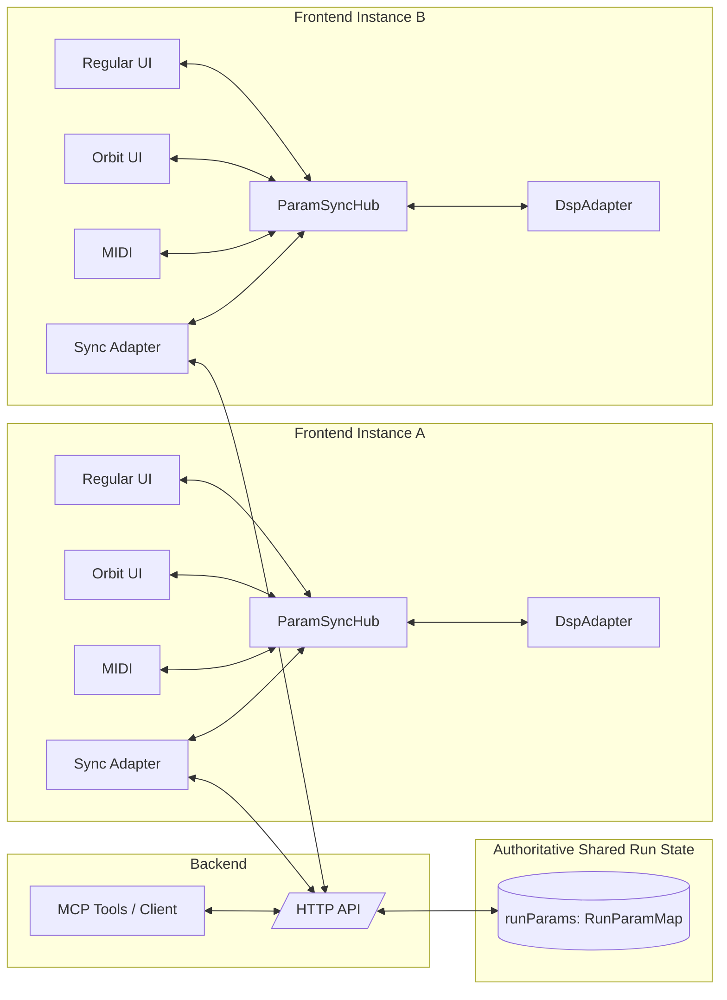
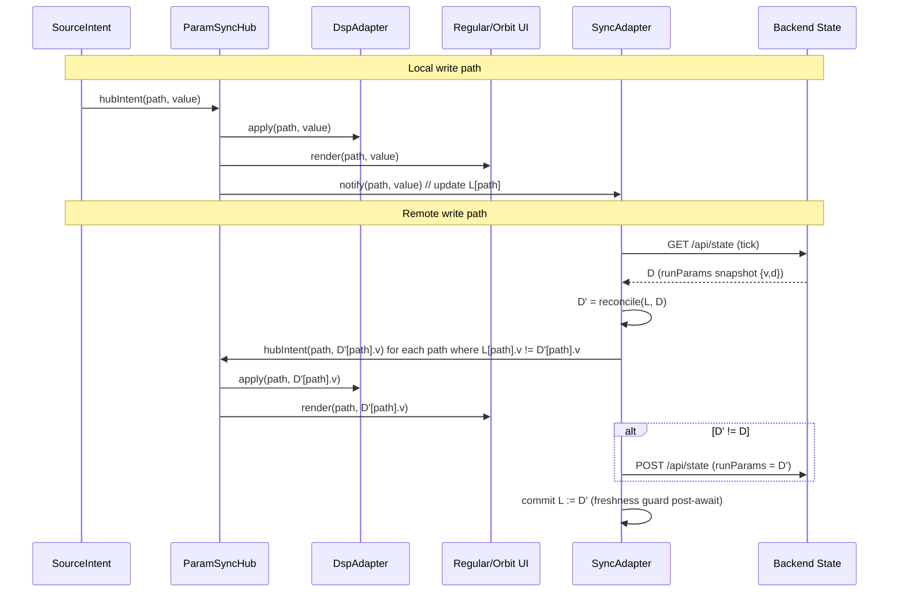

# SPECIFICATION-RUN-PARAM-SYNC

## Scénario de référence

Deux instances frontend A et B affichent la même session en vue Run.

- A modifie un paramètre Faust depuis `Regular UI`, `Orbit UI`, MIDI, ou clavier.
- La valeur locale est appliquée immédiatement au DSP et aux interfaces locales (Regular, Orbit, Sync).
- Le backend persiste des cellules horodatées `RunParamCell = { v, d }` et les renvoie telles quelles au polling.

Le système doit préserver une vision cohérente des paramètres malgré les délais réseau, le polling, et les mises à jour concurrentes.

## Objet de cette spécification

Cette spécification formalise le protocole de synchronisation des paramètres Run, avec un focus particulier sur:

- la propagation locale (intra-frontend),
- la propagation distante (frontend <-> backend),
- la prévention des boucles de messages,
- la robustesse des contrôles impulsionnels (`button`: press/release).

## Vocabulaire

- `Path`: identifiant d'un paramètre Faust (ex: `/gain`).
- `Value`: valeur scalaire du paramètre.
- `RunParamCell`: cellule horodatée contenant la valeur d'un paramètre.
- `Snapshot`: map complète `Path -> RunParamCell`.

## Types

```adt
Path         ::= String
Value        ::= Number
Timestamp    ::= Number                          (* ms epoch *)

RunParamCell ::= { v: Value, d: Timestamp }      (* cellule horodatée *)
RunParamMap  ::= Map<Path, RunParamCell>
Version      ::= Timestamp
```

## Protocole HUB <-> Adapters

Le protocole normatif d'entrée du hub est unique:

```text
hubIntent(path: Path, value: Value)
```

Le hub applique ensuite une seule transition canonique:

```text
1) normalize/validate intent
2) apply to DSP
3) apply to all UI clients (Regular, Orbit, Sync)
```

## Séparation des canaux UI

Pour toute UI (`Regular`, `Orbit`, `MIDI UI éventuelle`), deux canaux doivent être séparés:

```text
UI -> HUB : onUserChange(path, value)          // autorisé à appeler hubIntent
HUB -> UI : applyFromHub(path, value, version) // ne doit jamais appeler hubIntent
SYNC -> HUB : hubIntent(path, value)           // application locale après réconciliation SYNC
```

Règle de timestamp côté SYNC (sur notification HUB):

```text
onHubValue(path, value):
  L[path] = { v: value, d: Date.now() }
```

Cette règle garantit que les écritures locales portent un timestamp frais, nécessaire pour que la
réconciliation `R-6` donne priorité au local face à des valeurs backend plus anciennes.

Contrainte:

```text
SC-UI-1: applyFromHub(...) ne doit jamais réémettre un intent utilisateur.
SC-UI-2: toute réinjection programmée détectée doit être ignorée (anti-echo).
```

## Architecture de synchronisation Run

Le modèle architectural normatif est un modèle "concentrateur local + état partagé distant".



### A-1: Composants d'une instance frontend

```text
Component SourceIntent := RegularUI | OrbitUI | MidiInput | KeyboardInput
Component ParamSyncHub
Component DspAdapter
Component SyncAdapter
Component SharedRunStateStore
Component BackendMcpClient
```

### A-2: Responsabilités

- `SourceIntent` produit des intentions de mise à jour `(path, value)`.
- `ParamSyncHub` est l'unique point d'écriture logique local:
  - reçoit les intents locaux,
  - applique la valeur au DSP,
  - diffuse la valeur à toutes les UIs clientes (Regular, Orbit, Sync).
- `DspAdapter` applique la valeur au DSP (`setParamValue` DSP) et relaie les changements DSP vers le hub.
- `SyncAdapter` gère la synchronisation backend:
  - maintient un état local `L: Path -> (v, t)` (observé depuis le HUB),
  - exécute une boucle périodique `tick` (poll + réconciliation + publish éventuel),
  - lit l'état backend courant `D` à chaque tick (pas d'état distant persistant requis),
  - calcule `D' = reconcile(L, D)` par timestamp,
  - réinjecte via le HUB les paths où `L[p].v != D'[p].v`,
  - publie vers backend uniquement si `D' != D`,
  - commit `L := D'` avec garde d'atomicité post-`await`.
- `SharedRunStateStore` est l'état partagé distant autoritatif.
- `BackendMcpClient` est une source backend (pas frontend) qui écrit/lit via l'API.

### A-3: Flux normatif (écriture locale)

```text
SourceIntent -> ParamSyncHub
ParamSyncHub -> DspAdapter
ParamSyncHub -> RegularUI
ParamSyncHub -> OrbitUI
ParamSyncHub -> SyncAdapter (value update, maj de L)
SyncAdapter(tick) -> Backend API (GET state)
SyncAdapter(tick) -> SyncAdapter (compute D' = reconcile(L, D))
SyncAdapter(tick) -> ParamSyncHub (apply paths where L != D')
SyncAdapter(tick) -> Backend API (POST state if D' != D)
```

### A-4: Flux normatif (écriture distante)

```text
SyncAdapter (tick: poll + reconcile) -> ParamSyncHub
ParamSyncHub -> DspAdapter
ParamSyncHub -> RegularUI
ParamSyncHub -> OrbitUI
```



### A-5: Contrainte d'architecture

```text
CA-1: Aucun composant SourceIntent ne doit écrire directement dans le backend.
CA-2: Regular UI et Orbit UI ne doivent pas muter l'état partagé sans passer par ParamSyncHub.
CA-3: Toute mutation locale ou distante de paramètre doit traverser ParamSyncHub.
CA-4: MCP agit côté backend via API; MCP n'est pas une source d'intention frontend.
CA-5: SharedRunStateStore est la référence autoritative pour la convergence inter-instances.
CA-6: Le hub expose un seul ingress `hubIntent(path,value)`. La réconciliation distant/local est faite par SYNC.
CA-7: Toute UI respecte la séparation `onUserChange` vs `applyFromHub`.
CA-8: Le HUB ne porte pas la logique de réconciliation backend; cette logique appartient à SYNC.
```

### A-6: Mapping implémentation actuelle

Dans l'implémentation actuelle:

- `ParamSyncHub` est principalement réalisé par:
  - `setParamValue`
  - `setParamCell`
  - `applyRemoteRunParams`
- `DspAdapter` est réalisé par:
  - `applyParamToDsp`
  - appels `dspNode.setParamValue(...)`
- `RegularUI/OrbitUI <-> Hub` est réalisé par:
  - `faustUIInstance.paramChangeByUI(...)` / `faustUIInstance.paramChangeByDSP(...)`
  - callback `FaustOrbitUI(..., onParamChange)` / `orbitUiInstance.setParams(...)`
- `SyncAdapter` est réalisé par:
  - `sendRunParamsSnapshot`
  - `syncRemoteRunState`
- `RegularUI/OrbitUI (rendu)` est réalisé par:
  - `faustUIInstance.paramChangeByDSP(...)` (Regular)
  - `orbitUiInstance.setParams(...)` / callbacks Orbit

## Interfaces observables

### Frontend -> Backend

```text
POST /api/state
{
  runStateSha: String | null,
  runParams: RunParamMap
}
```

où `RunParamMap` est:

```text
{
  "/pathA": { v: Number, d: Timestamp },
  "/pathB": { v: Number, d: Timestamp },
  ...
}
```

### Backend -> Frontend

```text
GET /api/state
{
  sha1: String | null,
  runParams: RunParamMap,
  ...
}
```

Le backend doit renvoyer les cellules horodatées (`v`, `d`) sans perdre l'information `d`.

## Règles de synchronisation

### R-0: État SYNC

SYNC maintient une map locale horodatée:

```text
L := LocalRunParamMap    // dernière valeur locale connue par path
```

À chaque tick, SYNC lit un snapshot backend courant:

```text
D := GET /api/state .runParams
```

`D` est une donnée de travail du tick; SYNC n'a pas besoin de la persister entre ticks.

### R-1: Représentation canonique

L'état partagé des paramètres Run est un `RunParamMap` (pas un flux d'événements).

### R-2: Écriture locale

Toute interaction locale doit converger vers une écriture canonique:

```text
hubIntent(path, value)
```

Quand HUB notifie SYNC de cette écriture locale, SYNC doit horodater immédiatement:

```text
L[path] = { v: value, d: Date.now() }
```

puis la boucle périodique de SYNC décide l'envoi backend:

```text
si D' != D alors POST /api/state avec runParams = D'
sinon aucun POST
```

### R-3: Arbitrage backend

Le backend fusionne `incoming` avec `current` via:

- ordre par timestamp `d`,
- remplacement de la cellule la plus ancienne par la plus récente.
- persistance explicite de `d` dans le store.

Formellement (résumé):

```text
Si incoming.d < existing.d => incoming ignoré.
Sinon la cellule est mise à jour avec (v, d).
```

Tie-break explicite au backend (par `path`):

```text
Si incoming.d == existing.d et incoming.v != existing.v:
  la dernière requête POST reçue par le backend gagne pour ce path
  (last-POST-received-wins per-path).
```

### R-3b: Ordre total de version

L'ordre entre deux écritures d'un même `path` est basé sur `timestamp`:

```text
Version := timestamp

si tA > tB: A est plus récent
si tA < tB: B est plus récent
si tA == tB: conflit d'égalité
```

Règle normative en cas d'égalité (`tA == tB`): `local wins`.
La valeur locale est conservée et republiée vers le backend.

### R-4: Application distante via SYNC

SYNC lit `runParams` backend (`D`), calcule `D' = reconcile(L, D)`, puis appelle:

```text
hubIntent(path, D'[path].v) pour chaque path où L[path].v != D'[path].v
```

Effets via HUB:

- mise à jour DSP local,
- mise à jour Regular UI,
- mise à jour Orbit UI.

### R-5: Prévention de boucle locale

Les mises à jour programmatiques DSP->UI ne doivent pas être réinterprétées comme entrées utilisateur.

Le frontend maintient:

- un garde réentrant (`suppressUiParamChangeDepth`),
- un filtre anti-écho asynchrone par `(path, value, until)`.

Règle normative SYNC (auto-réinjection):

```text
Quand SYNC applique une valeur réconciliée via hubIntent(path, v),
la notification HUB->SYNC correspondante ne doit pas réhorodater L[path]
(ne pas faire L[path] = { v, d: Date.now() } pour cet auto-écho).
```

Implémentation recommandée:

```text
SYNC enregistre un marqueur d'auto-apply (path, value, window courte),
puis ignore onHubValue(path, value) correspondant.
```

La garde de fraîcheur post-await reste un filet de sécurité,
mais ne remplace pas ce filtrage normatif.

### R-6: Réconciliation SYNC (per-path)

À chaque tick backend, SYNC réconcilie chaque `path` indépendamment :

```algorithm "Réconciliation SYNC à chaque tick"
Input: L (LocalRunParamMap), D (snapshot backend du tick)
Output: D' (map réconciliée)
for each path p in keys(L) ∪ keys(D) do
  if p ∈ L and p ∉ D then
    D'[p] := L[p]
  elif p ∉ L and p ∈ D then
    D'[p] := D[p]
  else
    if L[p].time ≥ D[p].time then           ▷ égalité de timestamp : local wins
      D'[p] := L[p]
    else
      D'[p] := D[p]
    end
  end
end
for each path p such that L[p].value ≠ D'[p].value do
  hubIntent(p, D'[p].value)                 ▷ application via HUB
end
if D' ≠ D then
  POST(D') to backend                       ▷ publication conditionnelle
end
L := D'                                     ▷ commit local + garde de fraîcheur post-await
```

## Invariants

```text
INV-1: Toute cellule stockée respecte RunParamCell.
INV-2: Une écriture plus ancienne (d plus petit) ne remplace jamais une cellule plus récente.
INV-3: Un paramètre mis à jour localement est appliqué immédiatement au DSP local.
INV-4: En l'absence de nouvelles écritures, tous les frontends convergent vers le même RunParamMap.
INV-5: Un bouton ne doit pas rester latched sans action utilisateur continue.
INV-6: Pour un path donné, la comparaison de version repose uniquement sur `timestamp`.
INV-7: Le flux HUB->UI ne crée pas de nouvel intent entrant vers HUB.
INV-8: Le backend conserve et renvoie `d` pour chaque cellule `RunParamCell`.
```

## Modèle press/release pour bouton

On modélise un bouton par deux écritures d'état:

```text
Press(path):   write(path, 1, d=t1)
Release(path): write(path, 0, d=t2), t2 > t1
```

Contrainte:

```text
Après Release(path), tout frontend doit converger vers value(path)=0.
```

Exigence normative UI (source de vérité press/release):

```text
press(path)   -> hubIntent(path, 1)
release(path) -> hubIntent(path, 0)
```

La UI doit aussi émettre `release(path)` sur les sorties d'interaction:

```text
pointerup, pointercancel, mouseleave, blur
```

## Diffusion locale vs diffusion distante

### Diffusion locale (dans une instance)

- `Regular UI` et `Orbit UI` doivent être des vues d'un même état local.
- Toute écriture sur une vue doit se refléter immédiatement sur l'autre.

### Diffusion distante (entre instances)

- polling périodique backend par `SYNC`,
- réconciliation per-path `D' = reconcile(L, D)` à chaque tick,
- publication conditionnelle du snapshot réconcilié (`POST` uniquement si `D' != D`),
- convergence via application HUB des paths divergents.

## Problème structurel identifié

Le protocole snapshot est simple mais les boutons impulsionnels (`1` puis `0` rapide) restent plus fragiles que les sliders:

- risque de `release` masqué/retardé,
- risque d'interférence avec états locaux "pressed".

## Points d'implémentation actuels (référence)

- Frontend Run:
  - `public/views/run.js`
    - `setParamValue`
    - `sendRunParamsSnapshot`
    - `syncRemoteRunState`
    - `applyRemoteRunParams`
    - gestion `pressedUiButtons`
    - filtres anti-boucle UI
- Backend merge:
  - `src/routes/app-state-routes.ts`
  - `src/routes/shared/run-param-utils.ts`
    - `mergeRunParamMaps`

## Risques explicites

```text
RISK-1: Press/release rapide d'un bouton dans une fenêtre de polling.
RISK-2: Release ignoré si état local "pressed" stale.
RISK-3: Réinjection locale d'un update distant (boucle UI).
RISK-4: Fin d'interaction UI non notifiée (flush final manquant).
RISK-5: Collision de timestamps (égalité ms) => politique `local wins` non strictement symétrique inter-frontends.
```

## Exigences de vérification

Pour chaque source (`Regular`, `Orbit`, `MIDI`, `BackendMCP`), valider:

```text
TEST-1: Slider A -> B (Regular+Orbit) converge.
TEST-2: Button press A -> B converge à 1.
TEST-3: Button release A -> B converge à 0.
TEST-4: A et B écrivent concurremment sur le même path, résultat déterministe.
TEST-5: Absence de boucle infinie de messages (trafic borné).
TEST-6: Égalité de timestamp entre local et backend -> local conservé puis republié.
TEST-7: `applyFromHub` n'émet jamais de `hubIntent` (anti-réinjection).
```

## Instrumentation minimale recommandée

Logs structurés par `path`:

```text
[run-sync] local-write path=... v=... d=...
[run-sync] snapshot-send size=...
[run-sync] remote-apply path=... v=... d=...
[run-sync] remote-skip reason=... path=...
```

Cette instrumentation est normative pour déboguer les cas impulsionnels.

## Évolution possible (non implémentée ici)

Pour les boutons, compléter le modèle snapshot par un canal événementiel:

```text
ButtonEvent := { path, action: "press"|"release", at }
```

But:

- conserver la simplicité snapshot pour sliders,
- ajouter une sémantique explicite d'événement pour impulsions,
- éliminer l'ambiguïté des transitions `1 -> 0` sous délais/polling.
